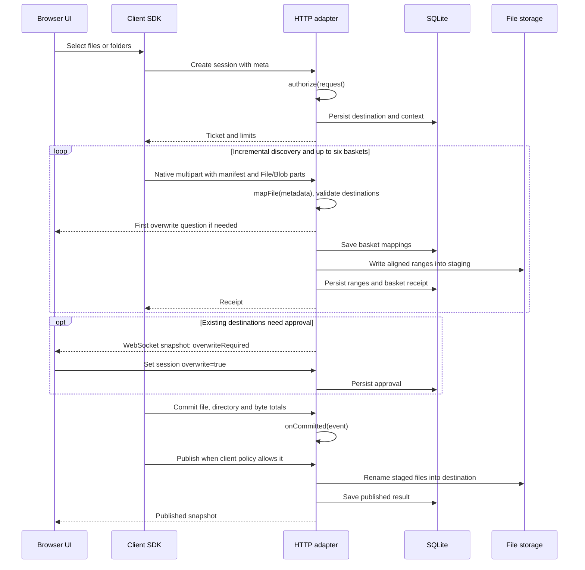

# MFUP/3 architecture

MFUP/3 uploads browser files through native `multipart/form-data`. Its session layer provides bounded directory discovery, grouped requests, range receipts, overwrite approval and publication.

## Components

| Package        | Responsibility                                                                |
| -------------- | ----------------------------------------------------------------------------- |
| `@mfup/client` | Input adapters, six-request scheduler, HTTP control, notifications and resume |
| `@mfup/react`  | React hooks over the client session and its snapshots                         |
| `@mfup/server` | Node HTTP/WebSocket adapter, multipart receiver and SQLite engine             |
| `mfup-core`    | Framework-independent Python session engine                                   |
| `mfup-fastapi` | FastAPI router, lifecycle and streaming multipart receiver                    |

The Node and Python adapters implement the same [HTTP protocol](PROTOCOL.md) and equivalent [extension contracts](EXTENDING.md). Applications supply identity, authorization, destination mapping and processing. An application field such as `scope` travels through ordinary `meta`; the protocol does not define scope names or a scope service.

## Data flow

Server `autoPublish` can initiate publication after processing. Approval is stored whenever it arrives; it does not publish incomplete data. Mapping discovers destination conflicts during manifest reception.

## Scheduling and transport

Defaults are six concurrent requests, 128 file parts plus directory entries per basket, 32 MiB payload per basket, 16 MiB aligned file ranges and an 8 ms collection window. Queued and active work together are capped at 10000 records, with enumeration resuming at 5000. Available entries are assigned by basket load; a single ready file can start without waiting for six full baskets. Backpressure suspends directory enumeration while the queue is full.

`FileList` is already enumerated by the browser. Handles and directory entries are read incrementally; custom sources can be `AsyncIterable<Entry>`. FileList can carry relative file paths but cannot represent empty directories. Handles, entries or explicit directory entries can represent them.

The browser serializes File/Blob parts and chooses the multipart boundary. The SDK does not read the payload into JavaScript or compute a payload checksum. Fetch is the default; native XHR provides optional in-flight upload events. Six requests may share a single HTTP/2 connection; they do not create six independent bandwidth allocations.

WebSocket carries snapshots only. State-changing operations use HTTP. A WebSocket interruption does not cancel data requests. Reconnection subscribes to the current snapshot; a missed notification does not erase stored approval or receipts.

## Storage and coordination

One engine process owns its SQLite database and all assigned session roots. SQLite uses WAL and an exclusive owner lock. There is no Redis dependency or distributed coordinator. Multiple processes must not share these roots. The range size is pinned to the data directory.

Session metadata includes authorization results, `meta`, `context`, quotas, publication policy, processing status and overwrite approval. Files are staged under flat names derived from their relative paths; payload content is not hashed. Receipts are written only after the complete basket and its metadata are accepted. Metadata storage grows with files and received ranges.

The engine serializes operations within each session and publication across the process. Resume drains admitted requests before advancing the epoch. Cancellation records the terminal state before stopping active requests; callbacks cannot publish after cancellation. Cleanup waits for callbacks using staging, and the sweeper retries deferred removal.

A session can use an application-assigned absolute root. Its staging and published data are in that root, enabling same-filesystem rename. SQLite remains in the engine's metadata directory. Manifest reception persists destinations before body receipt. Publication walks pages of at most 256 nodes. A single rename is atomic; merging a tree is not one filesystem transaction. Recovery uses the plan and the presence of staged/destination files. Files already replaced during a partial publication are not rolled back. Applications must not modify destinations used by unfinished publication.

Receipts support recovery after a process restart. Payload fsync for power-loss durability is not performed. Published snapshots remain available until session retention expires; published files remain in the application destination.

## Transfer display and failures

`confirmedBytes` counts payload covered by receipts. With `trackUploadProgress: true`, `sentBytes` adds an estimate for active XHR requests, based on each multipart body's loaded fraction. Notifications are coalesced at 50 ms. Aborting a request removes its unconfirmed estimate. Resume always follows receipts.

The demo displays both values and caps its bar at 99% until publication. Discovery can increase the total during upload. The optional overwrite prompt and the operational error message each apply to the entire upload. Detailed state and retry behavior are part of the [protocol](PROTOCOL.md).

Snapshot confirmation can precede an HTTP receipt. The SDK tracks locally acknowledged bytes separately so `sentBytes` counts overlapping active payload only once. Late receipts from an earlier resume epoch do not add that payload again.

[Russian](ru/ARCHITECTURE.md)
