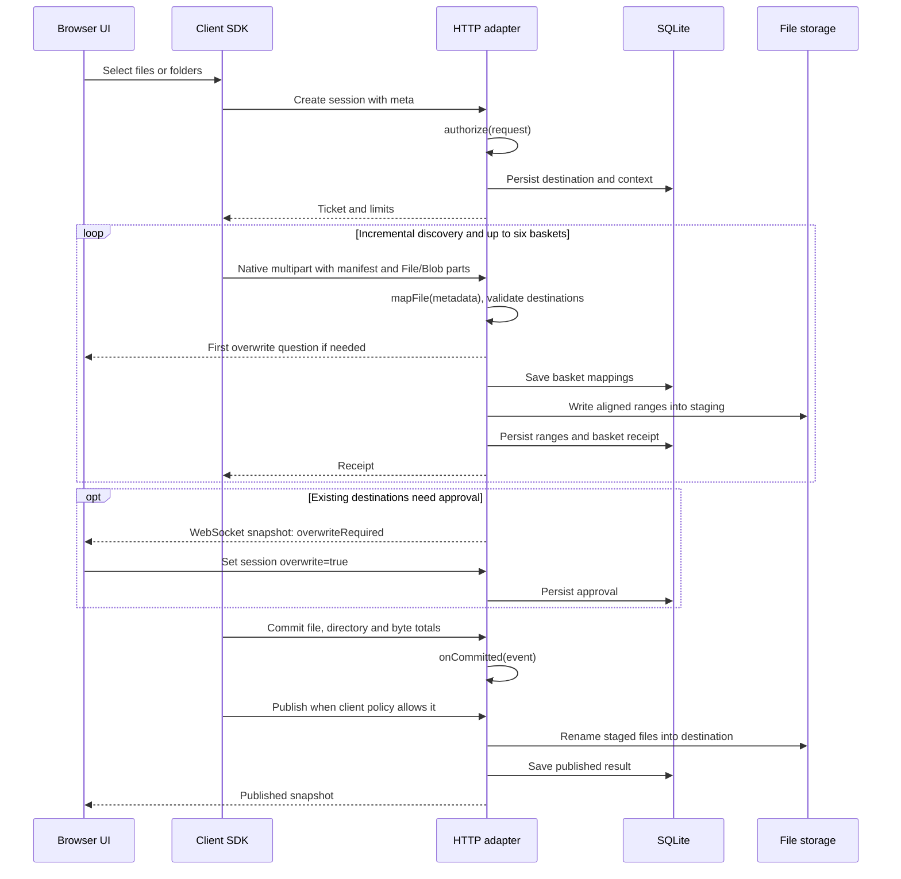

# Архитектура MFUP/3

MFUP/3 загружает браузерные файлы через обычный `multipart/form-data`. Уровень сессии обеспечивает постепенный обход каталогов с ограниченной очередью, группировку запросов, подтверждение диапазонов, разрешение перезаписи и публикацию.

## Компоненты

| Пакет          | Назначение                                                                                  |
| -------------- | ------------------------------------------------------------------------------------------- |
| `@mfup/client` | Адаптеры источников, планировщик шести запросов, HTTP-управление, уведомления и продолжение |
| `@mfup/react`  | React hooks поверх клиентской сессии и снимков состояния                                    |
| `@mfup/server` | Node HTTP/WebSocket adapter, приём multipart и SQLite engine                                |
| `mfup-core`    | Независимое от фреймворка ядро сессий Python                                                |
| `mfup-fastapi` | FastAPI router, жизненный цикл и потоковый приём multipart                                  |

Node и Python реализуют общий [HTTP-протокол](PROTOCOL.md) и сопоставимые [контракты расширения](EXTENDING.md). Приложение задаёт пользователя, авторизацию, маппинг назначения и обработку. Прикладное поле `scope` передаётся через обычный `meta`; протокол не определяет имена зон или отдельный сервис scopes.

## Поток данных

Серверный `autoPublish` может запускать публикацию после обработки. Разрешение сохраняется в момент получения и не публикует неполные данные. Маппинг обнаруживает конфликты назначения при получении манифеста.

## Планировщик и транспорт

По умолчанию используются шесть запросов, до 128 частей файлов и записей каталогов в корзине, 32 МиБ payload на корзину, выровненные диапазоны до 16 МиБ и окно сбора 8 мс. Очередь вместе с активными отправками ограничена 10000 записями; обход продолжается при сокращении до 5000. Элементы распределяются с учётом заполнения корзин; один готовый файл может отправиться без ожидания шести полных корзин. Заполненная очередь приостанавливает обход каталогов.

`FileList` уже перечислен браузером. Handles и directory entries читаются постепенно; пользовательский источник может быть `AsyncIterable<Entry>`. FileList передаёт относительные пути файлов, но не пустые каталоги. Handles, entries и явные directory entries могут их представить.

Браузер сериализует части File/Blob и выбирает multipart boundary. SDK не читает payload в JavaScript и не вычисляет его контрольную сумму. По умолчанию используется fetch; native XHR даёт опциональные события отправки внутри POST. Шесть запросов могут использовать одно HTTP/2-соединение и общую полосу пропускания.

WebSocket передаёт только снимки состояния. Изменения состояния выполняются через HTTP. Разрыв WebSocket не отменяет передачу файлов. Повторное подключение получает текущий снимок; пропущенное уведомление не удаляет сохранённые разрешения или receipts.

## Хранение и координация

Один engine-процесс владеет SQLite и всеми выданными корнями сессий. SQLite использует WAL и исключительную блокировку владельца. Redis и распределённого координатора нет. Несколько процессов не должны совместно использовать эти корни. Размер диапазона закреплён за каталогом данных.

Метаданные сессии содержат результат авторизации, `meta`, `context`, квоты, политику публикации, статус обработки и разрешение перезаписи. Файлы находятся в staging под плоскими именами, производными от относительных путей; содержимое не хешируется. Receipt записывается только после полного приёма корзины и её метаданных. Объём метаданных растёт с числом файлов и принятых диапазонов.

Engine упорядочивает операции внутри сессии и публикации внутри процесса. Resume дожидается допущенных запросов перед сменой epoch. Отмена фиксирует конечное состояние до остановки запросов; callbacks не могут публиковать после отмены. Очистка дожидается callbacks, использующих staging, а sweeper повторяет отложенное удаление.

Приложение может назначить сессии абсолютный корень. Её staging и опубликованные данные находятся в этом корне, что позволяет использовать rename в одной файловой системе. SQLite остаётся в каталоге метаданных engine. Назначения сохраняются при приёме манифеста до чтения тела. Публикация обходит страницы до 256 записей. Rename отдельного файла атомарен; слияние дерева не является одной транзакцией. Восстановление использует план и наличие файлов в staging/назначении. Уже заменённые файлы при частичной публикации не откатываются. Приложение не должно изменять назначения незавершённой публикации.

Receipts позволяют восстановиться после перезапуска процесса. Fsync payload для гарантии при потере питания не выполняется. Опубликованный снимок доступен до окончания хранения сессии; опубликованные файлы остаются в назначении приложения.

## Отображение передачи и ошибки

`confirmedBytes` учитывает payload с receipts. При `trackUploadProgress: true` значение `sentBytes` добавляет оценку активных XHR-запросов по доле отправленного multipart-тела. Уведомления объединяются с интервалом 50 мс. Прерывание запроса убирает неподтверждённую оценку. Resume всегда опирается на receipts.

Demo показывает обе величины и ограничивает полосу 99% до публикации. Обход может увеличивать общий размер во время передачи. Опциональный вопрос о перезаписи и сообщение об операционной ошибке относятся ко всей загрузке. Состояния и повторы описаны в [протоколе](PROTOCOL.md).

[English](../ARCHITECTURE.md)
